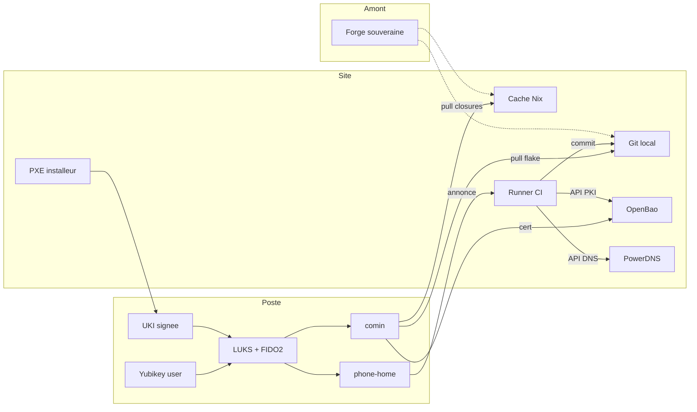

# Proposition d'architecture : poste de travail Sécurix et son écosystème

Ce document est une proposition, ouverte à discussion, sur l'architecture
cible d'un poste de travail Sécurix et de l'écosystème NixOS qui
l'entoure, dans un contexte **monosite**, avec **installations offline**
appuyées sur un miroir local, éventuellement répliqué depuis un amont
externe.

Il ne prétend pas prescrire : chaque proposition est défendable
isolément et peut être adoptée, adaptée ou rejetée. Le contexte
sous-jacent est le durcissement d'un poste admin au sens des guides
ANSSI PA-022 (administration sécurisée des SI) et NT-28 (durcissement
GNU/Linux), avec la souveraineté de l'administration sur ses données
et ses clés comme ligne directrice. Une extension ultérieure à
plusieurs sites est envisageable mais n'est pas traitée ici.

## 1. Principes directeurs

- **Souveraineté par administration** : chaque administration héberge
  et contrôle ses clés, secrets et journaux. Aucun opérateur central
  n'est obligatoire.
- **Uniformité de gestion** : mêmes outils, mêmes procédures, mêmes
  baselines entre administrations. La divergence se fait par overlay
  déclaratif, pas par fork du noyau.
- **Composer plutôt que réinventer** : l'écosystème s'appuie sur des
  briques existantes auditables (lanzaboote, OpenBao, age, Kanidm,
  Clan, comin, PowerDNS, attic), pas sur un monolithe propriétaire.
- **Activation explicite (opt-in)** pour tout changement disruptif.
- **Assertions avec message clair** plutôt que `mkForce` silencieux,
  en pointant vers `security.anssi.excludes` ou équivalent.
- **Registre de flakes indépendants** : chaque satellite est un flake
  distinct, versionné et signé.
- **Installations offline** : le provisionnement et l'exploitation
  des postes se font sans connectivité externe, grâce à un miroir
  local éventuellement répliqué depuis un amont externe.

## 2. Modèle de menace retenu

### Scénarios couverts

- Accès physique bref (jusqu'à ~30 minutes) : vol opportuniste,
  poste égaré, attaquant en salle de réunion.
- Disque prélevé et analysé hors site.
- Compromission réseau locale (réseau WiFi hostile, LAN ouvert).
- Compromission d'un compte utilisateur (reprise de session,
  élévation de privilèges).
- Compromission légère de la chaîne d'approvisionnement logicielle.

### Scénarios hors périmètre

- Attaque matérielle sophistiquée (implant TPM, sonde JTAG,
  décapsulation) : hors du budget défensif raisonnable.
- Cold boot attack sur la mémoire vive sans protections BIOS
  spécifiques : à traiter par module dédié si la flotte le permet.
- Attaquant disposant d'une présence hardware persistante.
- Vol simultané du poste **et** des deux Yubikey FIDO2 de
  l'utilisateur **et** de la clé de recouvrement administrateur : le
  compromis triple n'est pas couvert par la cryptographie.

### Justification du cadrage

Le choix de déchiffrer LUKS par **FIDO2** plutôt que par TPM
auto-unlock neutralise structurellement la classe d'attaques de
contournement TPM (incluant celle décrite par oddlama en 2025) :
sans présence physique d'une Yubikey enrôlée, il n'existe aucun
déchiffrement automatique à détourner.

## 3. Architecture en quatre couches

```
┌─────────────────────────────────────────────────────────┐
│ L3  Gestion de la flotte                                 │
│  Cache binaire admin, PKI, secrets dynamiques,           │
│  attestation continue, pipeline auto-config, PowerDNS    │
├─────────────────────────────────────────────────────────┤
│ L2  Satellites (flakes indépendants)                     │
│  securix-sat-microseg, securix-sat-logshipper,           │
│  securix-sat-openbao-bridge, securix-sat-fido2-fleet…    │
├─────────────────────────────────────────────────────────┤
│ L1  Profil d'administration (overlays sur L0)            │
│  securix-admin-<MinistereX>, politiques, niveau de       │
│  sensibilité, matrice matériel supporté                  │
├─────────────────────────────────────────────────────────┤
│ L0  Noyau Sécurix (cloud-gouv/securix)                   │
│  Baseline ANSSI commune, modules de durcissement, tests  │
└─────────────────────────────────────────────────────────┘
```

### Tableau synthétique des briques

| Rôle | Composant | Emplacement |
|---|---|---|
| Baseline ANSSI | Sécurix (noyau) | Flake admin (L0) |
| Profil d'administration | Overlays par admin | Flake admin (L1) |
| Chaîne de boot signée | `lanzaboote` | Poste (L2) |
| Déchiffrement disque | `systemd-cryptenroll` + FIDO2 | Poste (L2) |
| Clé de recouvrement LUKS | Passphrase longue, chiffrée `age` | Archive OpenBao |
| Microségmentation réseau | `nixos-microsegebpf` | Poste (L2) |
| Journalisation | Vector (log-shipper) | Poste (L2) |
| Secrets statiques versionnés | `age` / `sops-nix` | Flake admin |
| Secrets dynamiques, PKI, révocation | OpenBao | Serveur local |
| Identité utilisateur et FIDO2 | Kanidm | Serveur local |
| Installation initiale et services | Clan | Orchestrateur local |
| MCO en pull continu | `comin` | Poste |
| Annonce et heartbeat | phone-home | Poste ↔ Runner |
| Inventaire DNS et API | PowerDNS | Serveur local |
| Sources git | Forgejo local | Serveur local |
| Cache binaire Nix | `attic` | Serveur local |
| Runner de pipeline | Forgejo Actions ou équivalent | Serveur local |
| Signature Secure Boot | Service centralisé HSM + OpenBao | Serveur local (coffre pour PK) |
| Attestation TPM continue | Quote PCR 0/2/4/7 + hash closure | Poste → OpenBao |

### Schéma d'ensemble



Chaque couche est une contribution distincte, versionnable et
substituable. Un satellite L2 peut être adopté par une administration
et refusé par une autre. Le noyau L0 reste le socle partagé.

## 4. Déploiement et sécurisation au démarrage

### 4.1 Chaîne de confiance cible

```
UEFI (Secure Boot, clés admin enrôlées centralement)
 → lanzaboote stub (UKI signée par le service centralisé)
   → kernel (mesuré dans PCR 4)
     → initrd (hash intégré à l'UKI signée, non modifiable)
       → déchiffrement LUKS (Yubikey FIDO2 obligatoire)
         → système cible monté
```

Le TPM2 reste présent **indépendamment** du déchiffrement LUKS. Il
fournit l'attestation continue (quote PCR 0/2/4/7, hash de la closure
active, hash de l'UKI en cours) et peut stocker des clés applicatives
PKCS#11, mais il ne conditionne plus le montage du disque.

### 4.2 Infrastructure locale

```
┌──────────────────────────────────────────────────────────────┐
│ Infrastructure admin (isolée, contrôle physique strict)       │
├──────────────────────────────────────────────────────────────┤
│ Artefacts statiques (git, versionnés) :                        │
│  • Flake admin (profil Sécurix + overlays + secrets chiffrés  │
│    age pour les destinataires autorisés)                      │
│  • Cache binaire Nix signé par clé admin (attic)              │
│  • Image installeur NixOS signée                              │
│                                                                │
│ Serveurs actifs locaux :                                       │
│  • Serveur PXE/iPXE                                           │
│  • Forgejo local (miroir des sources, éventuellement          │
│    répliqué depuis un amont externe)                          │
│  • attic local (cache binaire)                                │
│  • OpenBao local (PKI, secrets dynamiques, audit)             │
│  • PowerDNS local (zone déléguée + API inventaire)            │
│  • Runner de pipeline (Forgejo Actions ou équivalent)         │
│  • Endpoint phone-home                                        │
│  • Kanidm (identité utilisateur + FIDO2)                      │
│  • Service de signature Secure Boot (HSM + OpenBao)           │
│                                                                │
│ Clés hors ligne (coffre physique, double contrôle) :           │
│  • Clé privée Secure Boot PK (racine)                         │
│  • Sauvegardes Secure Boot KEK et db                          │
│  • Autorité de recouvrement LUKS                              │
└──────────────────────────┬───────────────────────────────────┘
                           │ VLAN de provisionnement isolé
                           ▼
                ┌──────────────────────────┐
                │ Poste vierge              │
                │ TPM2 activé, SB en setup │
                └──────────────────────────┘
```

### 4.3 Réplication optionnelle depuis un amont externe

L'infrastructure locale fonctionne en autonomie. Un amont externe
(forge souveraine, forge interministérielle ou dépôt partagé) peut
alimenter périodiquement le miroir local, mais sa disponibilité
n'est jamais une condition du fonctionnement courant.

Artefacts concernés par la réplication :

| Artefact | Mécanisme | Fréquence typique | Vérification |
|---|---|---|---|
| Sources git | Miroir Forgejo / `git clone --mirror` | Quotidien ou sur événement | Signature des commits |
| Cache binaire Nix | `attic push` / `attic pull` | Hebdomadaire ou sur MAJ | Signature des closures |
| Images installeur | `nix copy` vers cache local | Sur MAJ | Signature amont |
| Listes de révocation (certs, FIDO2, Secure Boot `dbx`) | Pull HTTP + signature `age` | Horaire à quotidien | Signature `age` |
| Sauvegardes OpenBao | Non répliqué | — | Souveraineté |

Bootstrap initial : trois cas distincts peuvent se présenter, un
démarrage avec accès internet initial puis bascule offline, un
démarrage air-gap dès le départ par export physique depuis un
amont, ou une autonomie totale sans amont avec flake et PKI
propres. Dans tous les cas, l'amorçage est reproductible et
documenté.

Risque amont compromis : la signature obligatoire des artefacts, la
vérification systématique en réception, un délai de coexistence
avant ingestion en production et un canal de révocation hors bande
sont les contre-mesures minimales.

### 4.4 PowerDNS et inventaire DNS

Une instance PowerDNS locale est configurée de manière déclarative
via le module NixOS `services.powerdns`. La hiérarchie de zones
proposée :

```
<admin>.gouv.fr                                (admin existante)
 └── securix.<admin>.gouv.fr                    (délégation dédiée)
      ├── git.securix.<admin>.gouv.fr          (forge locale)
      ├── cache.securix.<admin>.gouv.fr        (attic local)
      ├── openbao.securix.<admin>.gouv.fr      (OpenBao local)
      ├── fleet.securix.<admin>.gouv.fr        (endpoint phone-home)
      ├── pxe.securix.<admin>.gouv.fr          (serveur PXE)
      ├── kanidm.securix.<admin>.gouv.fr       (identité utilisateur)
      └── machines/<serial>.securix.<admin>.gouv.fr
                                                (un enregistrement
                                                 par poste, créé par
                                                 le pipeline)
```

**Rôles du DNS** :

- Discovery des services pour Clan, comin, phone-home, OpenBao
- Source de SAN pour les certificats TLS émis par OpenBao PKI
- Identité des postes (A/AAAA + PTR) cohérente avec les certificats
- Inventaire consultable via enregistrements TXT signés DNSSEC
- Split-horizon : la vue interne n'est pas exposée publiquement

**API d'enregistrement pour l'inventaire** : le pipeline utilise
l'API PowerDNS pour créer, mettre à jour ou supprimer les
enregistrements des postes. Les enregistrements par poste :

| Type | Nom | Contenu | Rôle |
|---|---|---|---|
| A / AAAA | `<serial>.securix.<admin>.gouv.fr` | IP du poste | Résolution directe, SAN du certificat machine |
| PTR | `<ip-reverse>.in-addr.arpa` | `<serial>.securix.<admin>.gouv.fr` | Cohérence DNS inverse |
| TXT | `<serial>.securix.<admin>.gouv.fr` | `vendor=X;model=Y;tpm=2.0;admin=Z;edition=hardened;provisioned=...` | Métadonnées d'inventaire |
| TLSA | `_443._tcp.<serial>.securix.<admin>.gouv.fr` | Fingerprint cert | Pin TLS via DANE (optionnel) |

Sécurisation de l'API : clé API chargée depuis `agenix`,
`webserver-allow-from` restreint au runner CI, API exposée
uniquement sur le segment d'administration, journalisation des
appels via le log-shipper vers OpenSearch, rate limiting côté
pipeline.

Cycle de vie d'un enregistrement : création au provisionnement,
mise à jour sur changement d'IP ou de métadonnées, passage en
quarantaine sur échec d'attestation, suppression au recyclage du
poste.

DNSSEC obligatoire pour la zone `securix.<admin>.gouv.fr`, signée
par une clé contrôlée par l'administration. Les transferts AXFR
éventuels (par exemple vers un secondaire de recouvrement) sont
protégés par TSIG.

### 4.5 Enrôlement centralisé Secure Boot

L'enrôlement et la gestion des clés Secure Boot (PK, KEK, db) sont
centralisés au niveau de l'administration, jamais déportés sur les
postes eux-mêmes.

```
┌─ Coffre hors ligne (double contrôle) ─────────┐
│ • Clé privée PK (racine Secure Boot)           │
│ • Usage rarissime : bootstrap ou rotation      │
└────────────────────────────────────────────────┘

┌─ Service de signature Secure Boot ─────────────┐
│ (local, adossé à HSM et OpenBao)               │
│ • Clés privées KEK et db dans HSM              │
│ • API via OpenBao :                            │
│   - sign-uki : signe une UKI donnée            │
│   - gen-auth-db / gen-auth-kek : produit des   │
│     variables EFI signées pour enrôlement      │
│   - revoke : signe une entrée dbx              │
│ • Double contrôle sur PK et KEK                │
│ • Journaux d'audit centralisés                 │
└──────────────────────┬─────────────────────────┘
                       │ publication des .auth
                       ▼
┌─ Cache local ──────────────────────────────────┐
│ • PK.auth, KEK.auth, db.auth (prêts à          │
│   l'enrôlement)                                │
│ • dbx.auth (liste de révocation courante)      │
└────────────────────────────────────────────────┘

┌─ Poste (provisionnement) ──────────────────────┐
│ • Télécharge les *.auth depuis le cache local  │
│ • sbctl enroll-keys / efi-updatevar            │
│ • Aucune clé privée ne transite                │
│ • Signature UKI : toujours demandée au service │
│   centralisé, jamais locale                    │
└────────────────────────────────────────────────┘
```

Ce modèle garantit qu'une compromission d'un poste ne donne jamais
accès au matériel de signature, que la rotation est pilotée en un
seul point et que les opérations critiques (PK, KEK) sont couvertes
par double contrôle humain.

### 4.6 Déroulé de déploiement en 14 étapes

| # | Phase | Action | Outils |
|---|---|---|---|
| 1 | Amorçage réseau | Démarrage PXE UEFI, récupération de l'image installeur NixOS signée depuis le serveur PXE local. | iPXE signée, image issue du flake admin |
| 2 | Authentification du poste | Liste d'accès par adresse MAC pré-enregistrée dans l'inventaire matériel. Validation optionnelle du certificat d'endorsement TPM (EK cert) contre la PKI des fabricants. OpenBao n'intervient pas à ce stade. | ACL PXE |
| 3 | Génération d'identité locale | L'installeur génère une paire `age` unique pour ce poste, clé privée stockée localement. | `age-keygen` wrappé |
| 4 | Annonce phone-home initiale | POST authentifié (mTLS + signature `age` + quote TPM optionnelle) vers `fleet.securix.<admin>.gouv.fr`. Payload : `serial`, `machine-id`, DMI (vendor, model, BIOS), CPU, RAM, disques, MAC, version TPM, statut Secure Boot, clé publique `age`, clé SSH publique éphémère. | phone-home étendu |
| 5 | Attribution IP et inscription DNS | Attribution d'une IP via le serveur DHCP local. Création via l'API PowerDNS des enregistrements A/AAAA, PTR, TXT dans la zone `securix.<admin>.gouv.fr`. Signature DNSSEC. | API PowerDNS + DNSSEC |
| 6 | Émission du certificat machine | API OpenBao PKI : émission d'un certificat TLS avec SAN = `<serial>.securix.<admin>.gouv.fr`, durée courte. | OpenBao PKI |
| 7 | Génération de la configuration Nix | Runner CI : commits dans le flake admin de `inventory/<serial>.yaml` et `machines/<serial>.nix` (plan `disko` adapté, profil matériel importé, options `securix.*` dérivées). Auto-merge liste blanche ou revue humaine. | Runner + templates |
| 8 | Enrôlement Secure Boot (centralisé) | L'installeur récupère les fichiers `PK.auth`, `KEK.auth`, `db.auth` depuis le cache local (distribués par le service de signature centralisé). Application via `sbctl enroll-keys`. Retrait des clés Microsoft selon politique. Aucune clé privée ne transite. | `sbctl`, `efi-updatevar` |
| 9 | Partitionnement | Application du plan déclaratif dérivé du hardware : ESP FAT32 + conteneur LUKS2 + BTRFS/LVM. | `disko` |
| 10 | Chiffrement disque (FIDO2 + clé de recouvrement) | Création LUKS2 avec volume key aléatoire. Enrôlement de la Yubikey principale : `systemd-cryptenroll --fido2-device=auto --fido2-with-client-pin=yes`. Enrôlement de la Yubikey de secours. Génération d'une clé de recouvrement (≥32 caractères aléatoires), enrôlement en keyslot passphrase. Chiffrement `age` de cette clé pour l'autorité de recouvrement, archivage dans OpenBao. Effacement sécurisé de la copie temporaire. | `systemd-cryptenroll`, `age` |
| 11 | Installation système | Installation de NixOS depuis le flake admin et le cache binaire local. Les secrets `age` destinés au poste sont déchiffrés à l'activation. | `clan machines install` (ou `nixos-anywhere`), `agenix` |
| 12 | Génération UKI signée | Demande de signature au service centralisé via OpenBao, qui vérifie le certificat machine et la quote TPM avant de signer. | `lanzaboote`, service centralisé |
| 13 | Premier démarrage | Secure Boot vérifie l'UKI. L'utilisateur insère et valide sa Yubikey principale pour déchiffrer LUKS. Le système démarre. | `systemd-cryptsetup` + FIDO2 |
| 14 | Attestation initiale et passage en MCO | Service `first-boot-attestation` : envoi à OpenBao d'un état initial (quote TPM PCR 0/2/4/7, hash closure, hash UKI). Activation de `comin` pour le pull continu depuis `git.securix.<admin>.gouv.fr`. Heartbeat phone-home persistant. Enrôlement utilisateur Kanidm (Yubikey déjà présentes, référencement central). | Client OpenBao, `comin`, Kanidm |

### 4.7 Défenses structurelles

Le modèle de déchiffrement par FIDO2 met hors de portée une classe
entière d'attaques (bypass TPM2 auto-unlock, confusion de systèmes
de fichiers décrite par oddlama) sans avoir à chaîner plusieurs
barrières cryptographiques. Les défenses restantes :

1. **UKI signée** par le service centralisé : toute modification de
   l'initrd ou du kernel invalide la signature, Secure Boot refuse
   le démarrage.
2. **Présence physique obligatoire** : sans l'une des deux Yubikey
   enrôlées, LUKS ne se déchiffre pas. La clé de recouvrement est
   chiffrée `age` et archivée hors du poste.
3. **Attestation continue par OpenBao** : toute divergence des PCR
   déclenche une alerte et peut mener à la révocation du certificat
   machine et des accès aux secrets.
4. **Secure Boot sous contrôle admin** : les clés Microsoft peuvent
   être retirées selon la politique, réduisant la surface
   d'attaque.

## 5. Industrialisation et maintien en condition opérationnelle

### 5.1 Gestion hybride des secrets : age et OpenBao

Les deux outils sont complémentaires.

| Secret / donnée | age (statique, dans le flake) | OpenBao (dynamique, runtime) |
|---|---|---|
| Clés publiques Secure Boot | ✅ | — |
| Clé privée Secure Boot PK | ❌ (hors ligne, coffre) | ❌ |
| Clés privées KEK et db | ❌ | HSM adossé à OpenBao |
| Identité bootstrap (installeur) | ✅ | — |
| Policies signées distribuées | ✅ | — |
| Identité `age` locale du poste | Générée au provisionnement | — |
| Certificat machine renouvelable | — | ✅ |
| Clé de recouvrement LUKS | ✅ (chiffrée pour autorité) | ✅ (archivage) |
| Jetons d'attestation | — | ✅ |
| Secrets applicatifs flotte | — | ✅ |
| Credentials éphémères | — | ✅ |
| Sauvegardes de clés critiques | ✅ (hors ligne) | — |

Chaîne d'amorçage : l'image installeur contient la clé publique
`age` « admin-bootstrap ». Le poste génère sa propre paire `age`
locale au provisionnement. Sa clé publique est enregistrée dans
OpenBao, authentifiée par le certificat de l'installeur. À partir
de là, OpenBao gère le quotidien ; `age` couvre ce qui est
versionné dans le flake.

Modules NixOS mobilisables : `agenix`, `sops-nix`, module `openbao`
déjà présent dans Sécurix.

### 5.2 Rotation des clés et cycle de vie

| Type de clé/secret | Fréquence | Portée | Automatisable | Risque en cas d'échec |
|---|---|---|---|---|
| PIN Yubikey (FIDO2) | Événementiel (choix user) | Utilisateur | Non (choix personnel) | Blocage après N échecs |
| Yubikey utilisateur | Événementiel (perte) | Utilisateur | Partiellement | Perte d'accès, secours par 2ᵉ Yubikey ou clé de recouvrement |
| Clé de recouvrement LUKS | Annuelle ou sur incident | Poste | Oui (regénération + archivage `age`) | Nécessite présence d'une Yubikey |
| Clé de signature UKI (db) | Annuelle | Flotte | Oui (via service centralisé) | UKI invalide, démarrage impossible |
| Secure Boot (PK, KEK) | 5 à 10 ans ou sur incident | Flotte entière | Non (double contrôle) | Immobilisation de la flotte |
| Certificat machine (OpenBao PKI) | Hebdomadaire à mensuelle | Poste | Oui (agent local) | Mise en quarantaine |
| Jetons et secrets applicatifs | Horaire à hebdomadaire | Agent | Oui (durée courte) | Délai de tolérance dépassé |

Trois principes transverses :

- **Versionnement via le flake admin** : chaque rotation est un
  commit traçable. Retour arrière par `nixos-rebuild switch
  --rollback`.
- **Déploiement progressif par vagues** : 1 poste pilote → 10 % →
  50 % → 100 %. Pause automatique sur anomalie d'attestation.
- **Période de coexistence** : toute rotation accepte l'ancienne et
  la nouvelle valeur pendant une fenêtre configurable.

### 5.3 Pipeline d'auto-configuration phone-home + git

```
┌─ Poste (phone-home) ──────────────────────────────┐
│ POST { serial, machine-id, DMI, CPU, RAM, disks,   │
│        MAC, TPM version, SB status, age_pubkey }   │
└───────────────────┬───────────────────────────────┘
                    │ mTLS + signature age
                    ▼
┌─ Runner CI local ─────────────────────────────────┐
│ 1. Authentification (cert + signature)             │
│ 2. Attribution IP                                  │
│ 3. API PowerDNS : enregistrements A/PTR/TXT        │
│ 4. API OpenBao PKI : émission cert machine         │
│ 5. Commit flake : inventory/<serial>.yaml,         │
│    machines/<serial>.nix (auto-mergé si liste      │
│    blanche, sinon revue humaine)                   │
│ 6. Notification au poste : config prête            │
└───────────────────────────────────────────────────┘
```

Patterns de sécurité du pipeline :

- mTLS obligatoire pour l'annonce
- Signature `age` du payload
- Nonce et timestamp pour anti-rejeu
- Liste blanche des fichiers modifiables automatiquement
  (uniquement `machines/<serial>.nix` et `inventory/<serial>.yaml`)
- Commits signés par clé CI stockée dans OpenBao
- Protection de la branche `main`, revues N+1 hors liste blanche
- Journalisation des appels API

Variables remontées utilisables par le pipeline : identité
(`serial`, `machine-id`, MAC), firmware (vendor, model, BIOS
version), CPU (famille, flags TPM/SEV/TDX/AVX512), mémoire, stockage
(nombre et taille des disques), TPM (version, manufacturer), Secure
Boot (setup/user/disabled), réseau (NICs), sécurité (IOMMU, virt).

### 5.4 Outils de gestion de flotte

Ont été écartés pour ce contexte :

- NixOps, morph : en déclin ou moins maintenus
- Colmena, deploy-rs : push SSH uniquement, mal adaptés aux postes
  nomades et aux environnements déconnectés
- KubeNix, KuberNix, Nixlets : Kubernetes, hors scope
- Nixery : registry de conteneurs, hors scope
- terraform-nixos, terranix : infra cloud, mauvaise granularité
- Nixinate, pushnix, krops : minimalistes, sans secrets ni services

Triangle retenu :

| Outil | Sens | Rôle dans l'écosystème |
|---|---|---|
| **Clan** | Push SSH (+ vars pull) | Installation initiale et services lourds, catalogue communautaire |
| **comin** | Pull git côté poste | MCO en régime permanent, adapté postes nomades et air-gap |
| **phone-home** | Poste → serveur | Inventaire matériel, trigger du pipeline auto-config |

Le choix entre push (Clan) et pull (comin) est structurant. Pour
des postes admin gov avec nomadisme courant, pull via comin est
recommandé pour le quotidien. Clan reste pertinent au bootstrap.

Cache binaire : `attic` (fédéré, moderne) est un choix naturel ;
`harmonia` est une alternative minimaliste. Le doc reste neutre sur
ce choix, chaque administration peut décider selon ses préférences.

### 5.5 Attestation continue

Chaque poste publie périodiquement à OpenBao :

- Une quote TPM signée (PCR 0/2/4/7)
- Le hash de la closure système active
- Le hash de l'UKI en cours
- Un compteur anti-rejeu

OpenBao compare aux valeurs attendues signées pour chaque poste.
Toute divergence déclenche une alerte et peut, selon la politique
de l'administration, révoquer l'accès du poste aux secrets
applicatifs ou l'enregistrement DNS (mise en quarantaine).

## 6. Authentification utilisateur et gestion des identités

### 6.1 Politique PAM : FIDO2 principal, mot de passe en secours

La connexion au poste s'effectue **par FIDO2** (Yubikey déjà
présente pour le déchiffrement LUKS). Le mot de passe local reste
comme unique méthode de secours, avec des contraintes renforcées :

- Complexité obligatoire (≥16 caractères, diversité)
- Verrouillage progressif sur échecs (`faillock`, déjà présent dans
  les PR Sécurix)
- Alerte OpenBao à chaque usage (événement journalisé à investiguer)
- Expiration courte pour forcer la reprise du flux FIDO2

### 6.2 Absence d'annuaire LDAP/AD : propositions

L'absence d'annuaire LDAP ou Active Directory par défaut évite un
point de défaillance unique, une surface d'attaque classique, une
dépendance à une infrastructure Windows et une complexité de MCO
disproportionnée. En contrepartie, il faut fournir des alternatives
industrielles.

**Proposition 1 — Kanidm (recommandation par défaut)**. Serveur
d'identité moderne en Rust, WebAuthn/FIDO2 natif, groupes et RBAC,
PAM via `pam_kanidm`, OIDC pour les services web, LDAP en lecture
seule si nécessaire. Module NixOS officiel.

**Proposition 2 — Authentik ou Keycloak**. Pour les administrations
déjà outillées. Plus lourd, plus riche (workflows, délégation).

**Proposition 3 — OpenBao + FIDO2 direct**. Pour une petite flotte
(< 50 postes), OpenBao sert directement de référentiel d'identité.

### 6.3 Cycle de vie utilisateur

- **Arrivée** : création dans Kanidm, enrôlement de **deux**
  Yubikey FIDO2 (principale et sauvegarde), émission d'un
  certificat utilisateur par OpenBao PKI.
- **Changement de rôle** : modification des groupes dans Kanidm,
  propagation automatique via `pam_kanidm`.
- **Perte d'une Yubikey** : révocation de la clé publique,
  utilisation de la Yubikey de secours, émission d'une Yubikey de
  remplacement après vérification d'identité.
- **Départ** : désactivation du compte (journaux d'audit conservés
  selon la durée réglementaire), révocation de tous les
  certificats, retrait des Yubikey, effacement sécurisé du poste si
  restitution.

### 6.4 Intégration NixOS

Modules existants mobilisables : `services.kanidm` (officiel),
`security.pam.services.<name>.kanidm`, `services.kanidm-ssh-authorizer`.

Une option Sécurix pourrait synthétiser ces choix :

```nix
services.securix.identity = {
  backend = "kanidm";
  server = "kanidm.securix.<admin>.gouv.fr";
  enrollment.requireTwoFidoKeys = true;
  passwordFallback = {
    enable = true;
    alertOnUse = true;
  };
};
```

## 7. Questions ouvertes

- **Matrice matériel supporté** : la compatibilité FIDO2 en initrd
  et l'accès UEFI nécessaire à l'enrôlement Secure Boot varient
  selon les constructeurs. Une matrice maintenue serait précieuse.
- **Promotion de modules** : comment faire remonter un module L2
  utile vers le noyau L0 (cloud-gouv/securix) ? Processus de revue
  et critères d'acceptation à définir.
- **Attestation et conformité RGPD** : l'attestation continue
  produit des journaux côté OpenBao. Nature des données, durée de
  conservation et finalité à examiner.
- **Air-gap total sans amont** : procédure d'export physique
  initial (bundle git, archive de closures signée) à documenter
  pour un démarrage entièrement autonome.
- **Extension ultérieure à plusieurs sites** : si l'architecture
  évolue vers du multi-sites, la réplication DNS (master + slaves),
  la fédération OpenBao et la coordination Secure Boot seront à
  spécifier. Hors périmètre de la présente proposition.

## 8. Références

- ANSSI PA-022 v3.0, *Recommandations pour la sécurisation d'un
  système d'administration*.
- ANSSI NT-28 v2.0, *Recommandations pour la mise en œuvre de
  GNU/Linux dans un environnement de confiance*.
- oddlama, « Bypassing Disk Encryption with TPM2 Unlock » (janvier
  2025), <https://oddlama.org/blog/bypassing-disk-encryption-with-tpm2-unlock/>.
- nix-community/lanzaboote, <https://github.com/nix-community/lanzaboote>.
- openbao/openbao, <https://github.com/openbao/openbao>.
- ryantm/agenix, <https://github.com/ryantm/agenix>.
- Mic92/sops-nix, <https://github.com/Mic92/sops-nix>.
- kanidm/kanidm, <https://github.com/kanidm/kanidm>.
- clan.lol, <https://clan.lol>.
- nlewo/comin, <https://github.com/nlewo/comin>.
- zhaofengli/attic, <https://github.com/zhaofengli/attic>.
- PowerDNS Authoritative, <https://doc.powerdns.com/authoritative/>.
- Lennart Poettering, « Brave New Trusted Boot World » (octobre 2022).
