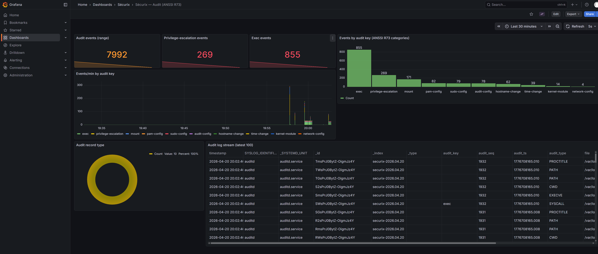

<!--
SPDX-FileCopyrightText: 2026 Aurélien Ambert <aurelien.ambert@proton.me>

SPDX-License-Identifier: CC-BY-SA-4.0
-->

# Centralised log shipping

`securix.o11y.logShipper` streams selected logs off a Sécurix
workstation through a single [Vector](https://vector.dev) instance to
one or both of:

- **OpenSearch** (HTTP bulk via the `elasticsearch` sink,
  `api_version = "v8"`)
- **A syslog collector** (RFC 5425 TLS / RFC 6587 plain TCP /
  RFC 3164 UDP)

Both sinks are independently opt-in and can be combined. Source-side
filtering lets the operator drop unwanted events before they cross
the network.

## Functional architecture

```
┌─────────────────────────────┐  ┌──────────────────────────────┐
│ systemd-journald            │  │ /var/log/audit/audit.log     │
│  sources.units (include)    │  │  sources.auditFile.enable    │
│  sources.currentBootOnly    │  │                              │
└──────────────┬──────────────┘  └──────────────┬───────────────┘
               │ journald                       │ file
               ▼                                ▼
         ┌─────────────────────────────────────────┐
         │ securix_parse (remap)                   │
         │  · parse_json merge on .message         │
         │  · audit record → audit_type / _ts /    │
         │    _seq / _key / source_type="auditd"   │
         └───────────────────┬─────────────────────┘
                             │
               ┌─────────────┴──────────────┐
               ▼                            ▼
     ┌──────────────────────┐    (if no filter declared,
     │ securix_filter_1…N   │     this stage is skipped)
     │  · filters[].dropIf  │
     │  · negated on the    │
     │    filter transform  │
     └──────────┬───────────┘
                │
    ┌───────────┴───────────────┐
    ▼                           ▼
┌──────────────────┐    ┌────────────────────────────┐
│ syslog_format    │    │ opensearch_logs            │
│  (RFC 5424 VRL)  │    │  · bulk API, api_version=v8│
│        │         │    │  · daily index template    │
│        ▼         │    │  · basic-auth via          │
│ syslog_out       │    │    LoadCredential          │
│  type=socket     │    └────────────────────────────┘
│  tcp+tls / tcp / │
│  udp             │
└──────────────────┘

              systemd service: securix-log-shipper
              DynamicUser, ProtectSystem=strict, SupplementaryGroups=[systemd-journal]
```

## Configuration examples

### 1 — Ship journald to OpenSearch only

```nix
{
  securix.o11y.logShipper = {
    sources.units = [ "sshd.service" "sudo.service" "auditd.service" ];

    sinks.opensearch = {
      enable = true;
      endpoint = "https://opensearch.corp.local:9200";
      auth = {
        user = "securix";
        passwordFile = "/run/keys/opensearch-pass";
      };
      tls.caFile = "/etc/ssl/certs/corp-ca.pem";
    };
  };
}
```

### 2 — Dual sink, auditd file source, source-side filtering

```nix
{
  securix.o11y.logShipper = {
    sources = {
      units = [ "auditd.service" "sshd.service" "sudo.service" ];
      auditFile.enable = true;           # tail /var/log/audit/audit.log
    };

    # Filters run in declaration order; an event dropped here is
    # dropped for EVERY enabled sink.
    filters = [
      {
        name = "drop_debug";
        dropIf = ''to_int(.PRIORITY) ?? 6 > 6'';
      }
      {
        name = "drop_noisy_identifiers";
        dropIf = ''.SYSLOG_IDENTIFIER == "CRON" || .SYSLOG_IDENTIFIER == "systemd-timesyncd"'';
      }
      {
        name = "keep_only_security_keys";
        dropIf = ''exists(.audit_key) && !includes(["exec","privilege-escalation","mount","kernel-module","kexec","pam-config","sudo-config","time-change"], .audit_key)'';
      }
    ];

    sinks.opensearch = {
      enable = true;
      endpoint = "https://opensearch.corp.local:9200";
      tls.caFile = "/etc/ssl/certs/corp-ca.pem";
    };

    sinks.syslog = {
      enable = true;                      # RFC 5425 over TLS by default
      endpoint = "siem.corp.local:6514";
      facility = "authpriv";
      tls = {
        caFile = "/etc/ssl/certs/corp-ca.pem";
        certFile = "/etc/ssl/certs/securix-client.pem";
        keyFile = "/etc/ssl/private/securix-client.key";
      };
    };
  };
}
```

### 3 — Syslog only, legacy UDP collector

```nix
{
  securix.o11y.logShipper.sinks.syslog = {
    enable = true;
    endpoint = "legacy-syslog.lan:514";
    mode = "udp";                         # emits an eval-time warning
    facility = "local4";
  };
}
```

The module emits a loud evaluation-time warning whenever `mode` is
anything other than `"tcp+tls"`, or when TLS certificate
verification is disabled. Security-relevant logs crossing untrusted
networks in plaintext should remain an explicit, acknowledged
choice.

## Dashboards (Grafana + `grafana-opensearch-datasource`)

Three ready-to-provision JSON dashboards ship in
`modules/o11y/dashboards/`. They expect a Grafana datasource
with `uid: opensearch` backed by the `grafana-opensearch-datasource`
plugin, `timeField: timestamp`, `logMessageField: message`,
`logLevelField: PRIORITY`, `database: securix-*`.

| File | Dashboard | Use case |
|------|-----------|----------|
| `securix-log-overview.json` | Sécurix — Log Overview | Global view: totals, rate by source, share by identifier, priority breakdown |
| `securix-ssh-focus.json`    | Sécurix — SSH Activity | Accepted / failed / invalid logins on sshd |
| `securix-audit.json`        | Sécurix — Audit (ANSSI R73) | Per-key breakdown aligned with R73 categories |

Typical provisioning layout (on the Grafana host, not Sécurix):

```yaml
# /etc/grafana/provisioning/datasources/opensearch.yml
apiVersion: 1
datasources:
  - name: OpenSearch
    uid: opensearch
    type: grafana-opensearch-datasource
    access: proxy
    url: http://opensearch.corp.local:9200
    jsonData:
      database: 'securix-*'
      flavor: opensearch
      timeField: 'timestamp'
      version: '2.19.2'
      logMessageField: 'message'
      logLevelField: 'PRIORITY'
      pplEnabled: true
```

```yaml
# /etc/grafana/provisioning/dashboards/securix.yml
apiVersion: 1
providers:
  - name: 'securix'
    orgId: 1
    folder: 'Sécurix'
    type: file
    options:
      path: /var/lib/grafana/dashboards/securix
```

Copy the JSON files from `modules/o11y/dashboards/` into
`/var/lib/grafana/dashboards/securix/` and restart Grafana — the
dashboards appear under the **Sécurix** folder.

### Sécurix — Audit (ANSSI R73) — example render



The capture above was taken against the reference lab setup
(Sécurix dev VM as the shipper, a second NixOS VM running
OpenSearch 2.19.2 + Grafana 12 + the `grafana-opensearch-datasource`
plugin). The shipper had been running for ~30 minutes; the audit
ruleset matched 7992 events split into ten R73 categories, with
*exec* (855) and *privilege-escalation* (269) dominating, followed
by *mount*, *pam-config*, *sudo-config*, *audit-config*,
*hostname-change*, *time-change*, *kernel-module* and
*network-config*.

## Limitations

- No built-in disk-backed buffer; Vector's default in-memory buffer
  is used. For durable delivery across reboots, override via
  `extraSettings` with `buffer.type = "disk"`.
- RFC 5425 compliance is partial: the default `newline_delimited`
  framing works with rsyslog / syslog-ng / Splunk / cloud SIEMs but
  is not strict octet-counting. Strict collectors can force
  `framing.method = "bytes"` via `extraSettings`.
- Filters run before sink routing. Per-sink routing differences
  (e.g. full journald to OpenSearch but only audit to a SIEM)
  require custom `extraSettings` on the concerned sink.
- The shipper does not apply retention or deduplication — those
  are the collector's job.
